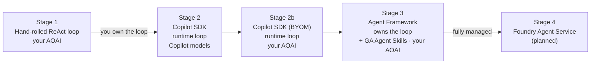

# Engines: the same skills, different loops

skill-forge is a learning project. The *capabilities* (two skills: `rag-search`
and `web-grounding`) and the *UI* stay fixed. What we swap is the **engine** —
the thing that owns the agentic loop and decides, turn by turn, which skill to
call. Every engine implements one interface (`app/engines/base.py:AgentEngine`)
and emits the **same** SSE events (`content`, `tool_call`, `error`, `done`), so
you can switch engines from the dropdown and compare them apples-to-apples.

This doc grows one section per engine as we build them.



The two axes this project teaches: **who owns the loop** and **whose model runs
underneath** (Copilot-hosted vs. your own Azure OpenAI, "BYOM").

- **Who owns the tool-calling loop:** Stage 1 = *you* (hand-rolled). Stages 2 and 2b run
  on the **Copilot runtime's** loop. Stage 3 = **Agent Framework** runs its own loop over
  a chat client (it is *not* a wrapper around the Copilot runtime — see the Stage 3
  section). Stage 4 = a hosted service.
- **Whose model:** Copilot-hosted (Stage 2) vs. your own Azure OpenAI (Stages 1, 2b, 3).
- **How skills are surfaced:** Stages 1, 2, 2b use our own synthetic
  `load_skill_instructions` tool for progressive disclosure. Stage 3 uses the **GA
  `SkillsProvider`** — the framework's native `load_skill` / `read_skill_resource`
  tools over the *same* `skills/` folders.

Clean A/B comparisons this enables:
- **Stage 2 vs. 2b** isolates *just the model backend* (same Copilot loop).
- **Stage 1 vs. 2b** isolates *just the loop owner* (same Azure OpenAI model — you own
  the loop vs. the Copilot runtime owns it).
- **Stage 1 vs. 3** isolates *your loop vs. a framework-managed loop* on the **same
  Azure OpenAI model** — and *our* skills plumbing vs. the **first-party Agent Skills**
  feature doing the same progressive-disclosure job.

---

## Stage 1 — Hand-rolled ReAct loop (`handrolled`)

**File:** `app/agent.py` (the loop) + `app/engines/handrolled.py` (adapter).

We write the Reason → Act → Observe loop ourselves and call **Azure OpenAI**
directly:

1. Send the system prompt (the skill catalogue) + history + tools to the model.
2. If the model returns tool calls, we execute them via `SkillToolset.call(...)`
   and append the results.
3. Loop until the model returns a final text answer (bounded by a step guard).

Every byte of orchestration is visible and editable. Tools are registered as an
OpenAI `tools=[...]` array built from the discovered skills, plus the synthetic
`load_skill_instructions` tool that powers **progressive disclosure** (the model
sees one-line descriptions and pulls a skill's full `SKILL.md` only when it needs
it).

**You provide:** an Azure OpenAI endpoint + deployment (keyless via
`DefaultAzureCredential`).

---

## Stage 2 — GitHub Copilot SDK (`copilot_sdk`)

**File:** `app/engines/copilot_sdk.py`. Package: `github-copilot-sdk`
(`from copilot import CopilotClient`).

Here we **do not write a loop at all**. The Copilot CLI *runtime* owns the
agentic loop; the SDK is a JSON-RPC client that drives it in-process. We:

1. Build SDK `Tool`s from the **same** `SkillToolset` — identical names,
   descriptions, and JSON schemas, including `load_skill_instructions`. The tool
   handlers call straight back into `SkillToolset.call(...)`, so **no skill logic
   is duplicated**.
2. `create_session(...)`, `send(prompt)`, and translate the runtime's event
   stream (`assistant.message_delta`, our tool start/complete, `session.idle`)
   into the shared SSE events.

The headline differences from Stage 1:

- **Auth & models:** authenticates as your **logged-in Copilot user** — no API
  key, no Azure OpenAI. It runs on Copilot's models (`gpt-5.x`, `claude-*`,
  `gemini-*`). Pick one with `COPILOT_SDK_MODEL` (default `gpt-5.4-mini`).
- **Who owns the loop:** the runtime. We lose direct control of the iteration
  but gain a managed loop (and free extras like context compaction / "infinite
  sessions").

**Progressive disclosure survives.** In testing, the Copilot model spontaneously
called `load_skill_instructions("rag-search")` and *then* `rag_search` — exactly
the Stage-1 pattern, with no special prompting.

**Built-in tools — and how we pin them out.** The Copilot runtime is a full
coding agent, so *by default* the model sees a **merged catalog**: our custom
skills **plus** the runtime's own built-ins (`view`/`read_file`, `edit`/`create`,
`shell`, web search, glob/grep, and an isolated set like `ask_user`, `task`,
`skill`). To keep the comparison honest — and match Stage 1's "only our tools
exist" — this engine passes `available_tools` as an **allowlist** of just our
three custom tools (`rag_search`, `web_grounding`, `load_skill_instructions`).
The runtime hides everything else from the model. Verified: with the allowlist
on, a knowledge-base question used *only* `load_skill_instructions` → `rag_search`
and no built-in tools at all.

---

## Stage 2b — GitHub Copilot SDK with BYOM (`copilot_sdk_byom`)

**File:** `app/engines/copilot_sdk_byom.py` (a ~30-line subclass of
`CopilotSdkEngine`) + `app/engines/byom.py` (the shared Azure provider config).

This is the **same engine as Stage 2** — the Copilot runtime still owns the loop,
skills are still SDK `Tool`s, the allowlist still pins out the built-ins — with
exactly **one thing changed: the model backend.** Instead of GitHub's hosted
models, we hand the runtime a `provider` config (BYOM, "Bring Your Own Model")
pointed at **your own Azure OpenAI deployment**:

```python
provider = {
    "type": "azure",
    "wire_api": "responses",
    "base_url": "https://<resource>.openai.azure.com",
    "azure": {"api_version": "2025-04-01-preview"},
    "get_bearer_token": <DefaultAzureCredential token callback>,  # keyless
}
session = await client.create_session(model="gpt-5.4-mini", provider=provider, ...)
```

Because *only* the model swaps, Stage 2 vs. 2b is a clean A/B: any behaviour
difference you observe is the **model**, not the orchestration. (And the inference
billing lands on your Azure subscription instead of Copilot's.)

Things worth knowing:

- **Auth is doubled.** The runtime still authenticates to GitHub to *start*
  (logged-in Copilot user), but **inference** goes to your Azure OpenAI — keyless
  via `DefaultAzureCredential` (`az login`), the same identity Stage 1 uses. Set
  `AZURE_OPENAI_API_KEY` to use key auth instead.
- **Encrypted-content constraint (important).** The Copilot SDK **encrypts prompts**
  before sending, so only model families that can decrypt that format work via BYOM:
  the **o-series and gpt-5 family**. `gpt-5.4-mini` ✅; a `gpt-4o` deployment fails
  with *"Encrypted content is not supported."* (`byom.py` checks for this and
  rewrites the error into a helpful message.)

---

## Stage 3 — Agent Framework + GA Agent Skills (`agent_framework_skills`)

**File:** `app/engines/agent_framework_skills.py`. Package: `agent-framework`
(`from agent_framework import Agent, SkillsProvider, FunctionTool`,
`from agent_framework.openai import OpenAIChatClient`).

This stage is the one place where **Microsoft Agent Framework owns the agentic
loop** — not our hand-rolled loop, and not the Copilot runtime. We build a native
`Agent` over an `OpenAIChatClient` pointed at *your* Azure OpenAI, and the
framework runs its own tool-calling loop. Two ideas define the stage:

- **Agent Framework runs the loop.** `Agent(client=..., tools=..., context_providers=...)`
  drives the model, executes tool calls, feeds results back, and streams the answer —
  the same job `app/agent.py` does by hand in Stage 1, but managed by the framework. No
  Copilot runtime is involved.
- **Skills come from the now-stable Agent Skills feature.** Instead of our synthetic
  `load_skill_instructions` tool, we attach
  [`SkillsProvider`](https://learn.microsoft.com/en-us/agent-framework/agents/skills?pivots=programming-language-python)
  as a `context_providers=[...]` entry. Before each run it discovers the **same**
  `skills/` folders (via `SkillsProvider.from_paths`), injects an *advertise* system
  prompt of skill names + descriptions, and adds the framework's native `load_skill`,
  `read_skill_resource`, and `run_skill_script` tools — the four-stage
  progressive-disclosure pattern, first-party.

  ```python
  skills_provider = SkillsProvider.from_paths(
      skill_paths=str(settings.skills_path),
      disable_load_skill_approval=True,          # read-only → run unattended
      disable_read_skill_resource_approval=True, # read-only → run unattended
  )                                              # run_skill_script keeps its approval gate
  agent = Agent(client=OpenAIChatClient(...), tools=[...], context_providers=[skills_provider])
  ```

How the two tool layers fit together (and why nothing is duplicated):

1. **Instructions + resources** are served by the provider natively. `load_skill`
   returns a skill's `SKILL.md` body; `read_skill_resource` serves bundled reference
   files under `references/` or `assets/`. Our SKILL.md folders already satisfy MAF's
   agentskills.io parser (frontmatter `name` must equal the folder name — ours do; the
   extra `enabled` key is ignored).
2. **Callable capabilities** (`web_grounding`, `rag_search`) stay our code-backed
   `tool.py` functions, exposed here as framework `FunctionTool`s built from the shared
   `SkillToolset` — byte-for-byte the same callables every other engine runs. We
   deliberately **drop** our `load_skill_instructions` tool here because the provider's
   `load_skill` replaces it.

The headline differences from Stage 1:

- **Who owns the loop:** **Agent Framework** (not you, not the Copilot runtime). Stage 1
  you read line-by-line in `app/agent.py`; here the same Reason → Act → Observe cycle is
  managed by `agent.run(...)`. This is the cleanest "hand-rolled vs. framework-managed
  loop" A/B in the project, on the *same* Azure OpenAI model.
- **How skills are surfaced:** the **first-party** `SkillsProvider` (`load_skill` /
  `read_skill_resource`) instead of our synthetic `load_skill_instructions`.

**Auth & model — simpler than 2b.** Only Azure OpenAI is needed — keyless via
`DefaultAzureCredential` (`az login`), the same identity Stage 1 uses, or an API key if
set. There is **no Copilot user and no prompt encryption**, so — unlike Stages 2b — **any
chat-capable deployment works, including `gpt-4o`.**

**Governance you get for free.** The provider's three tools are approval-gated by
default. We disable approval on the read-only `load_skill` / `read_skill_resource` so the
demo runs unattended, and leave `run_skill_script` gated (our skills ship no scripts, so
it is never usefully invoked — but the safe default stays visible). In production you'd
keep the gate on and wire a human-in-the-loop handler, plus per-agent/tenant filtering
and caching, all of which the provider supports.

**What Agent Framework buys you here.** A genuinely managed loop (you delete Stage 1's
~170 lines), plus the future-facing payoffs: **model portability** behind one agent API
(swap `OpenAIChatClient` for Foundry, Anthropic, etc. without touching the engine),
**multi-agent orchestration**, middleware, typed sessions, and observability/eval hooks —
and now a **standard, governed skills format** you author once and reuse across agents.

**Note on chips:** the UI's skill chips are emitted from our `FunctionTool` handlers, so
`web_grounding` / `rag_search` calls show up live. The provider's native `load_skill` /
`read_skill_resource` run transparently inside the framework and are not surfaced as
chips.

---

## Side-by-side

| Dimension              | Stage 1 — Hand-rolled            | Stage 2 — Copilot SDK                    | Stage 2b — Copilot SDK (BYOM)            | Stage 3 — Agent Framework + Agent Skills |
| ---------------------- | -------------------------------- | ---------------------------------------- | ---------------------------------------- | ---------------------------------------- |
| Who owns the loop      | **You** (`app/agent.py`)         | Copilot CLI **runtime**                  | Copilot CLI **runtime**                  | **Agent Framework** (native `Agent`)     |
| Loop code to maintain  | ~170 lines, fully visible        | ~0 (event translation only)              | ~0 (subclass adds ~1 option)             | ~0 (framework runs it)                   |
| Model / provider       | Your Azure OpenAI deployment     | Copilot models (gpt-5.x, claude, gemini) | **Your Azure OpenAI** (BYOM)             | **Your Azure OpenAI** (direct)           |
| Auth                   | `DefaultAzureCredential` (keyless)| Logged-in Copilot user (no key)         | Copilot user **+** keyless Azure         | Keyless Azure only (or API key)          |
| Tool registration      | OpenAI `tools=[]` from skills    | SDK `Tool(...)` from the **same** skills | SDK `Tool(...)` from the **same** skills | `FunctionTool(...)` + GA `SkillsProvider` |
| Progressive disclosure | Ours (`load_skill_instructions`) | Ours (carries over)                      | Ours (carries over)                      | **Native** `load_skill` / `read_skill_resource` |
| Tool selection control | Full — only your tools exist   | Full — `available_tools` allowlist     | Full — `available_tools` allowlist     | Skill tools approval-gated (read-only opted out) |
| Model constraint       | Any Azure deployment             | Any Copilot model                        | **o-series / gpt-5 only** (encryption)   | **Any Azure deployment** (incl. gpt-4o)  |
| Streaming              | Per-chunk content events         | `assistant.message_delta` → content      | `assistant.message_delta` → content      | `agent.run(stream=True)` updates → content |
| Extras you get free    | None                             | Compaction, session persistence          | Compaction, session persistence          | Managed loop, model portability, multi-agent, middleware, governed skills |
| Hosting / dependency   | OpenAI SDK + Azure endpoint      | Bundled Copilot runtime binary           | Copilot runtime + Azure endpoint         | `agent-framework` + Azure endpoint       |
| Lock-in                | Low (any OpenAI-compatible API)  | Medium (Copilot platform + subscription) | Medium (Copilot runtime, your model)     | Low–medium (framework; portable model backend) |

**Rule of thumb:**
- **Stage 1** when you need to *see and control* every step (debugging, custom
  routing, strict tool boundaries).
- **Stage 2** when you want a capable managed loop and your users already have
  Copilot — happy to run on Copilot's models.
- **Stage 2b** when you want that same managed Copilot loop but need inference on
  **your own Azure OpenAI** (data residency, billing, a specific deployment).
- **Stage 3** when you want a **framework-managed loop on your own Azure OpenAI** with a
  **standard, governed skills format** (approval, filtering, caching) and room to grow
  into **multi-agent** workflows or swap model backends — without the Copilot runtime or
  its encrypted-content constraint.

---

## Coming next

- **Stage 4 — Azure AI Foundry Agent Service** (hosted; tools run server-side):
  the fully-managed end of the spectrum.

Each will add a row to the table above and a section here.
